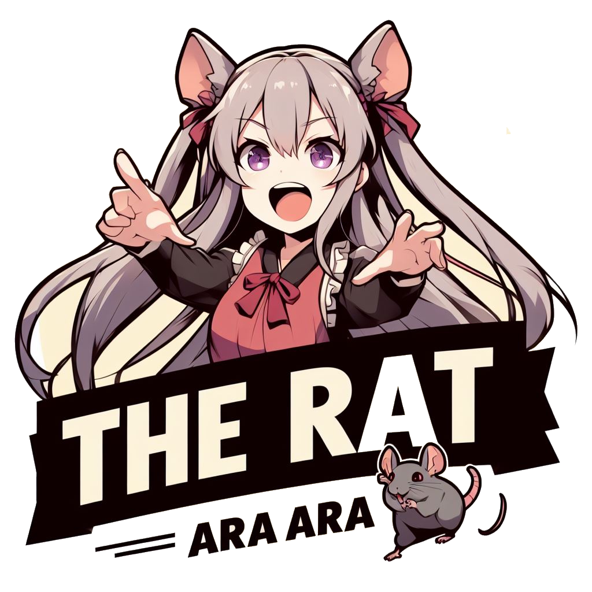

# The Rat

The Rat is the next-generation **container/virtual machine control panel**. It is **your one-stop shop for single application container, full system containers, and KVM instances**.

The Rat is **built on top of the incredible Incus platform**, making it **compatible with the same pre-made images available for a wide number of Linux distrubutions that Incus is**.

The Rat also includes an incredibly powerful but simple REST API.

If you want to check out out The Rat yourself, check out the **[getting started guide](https://hyeararat.com/docs/category/getting-started)**.
